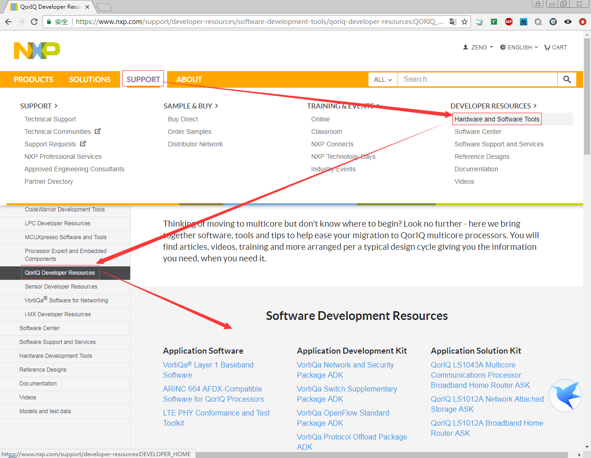
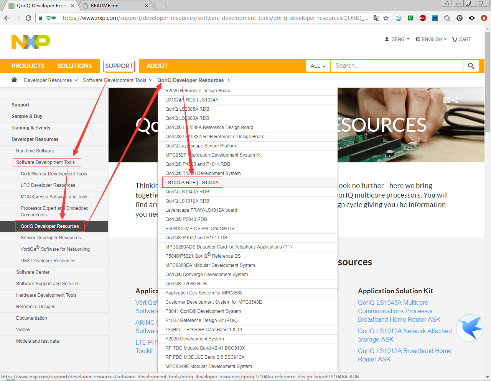

# LS1046A

## Software Developer Resources Position

## Start Guide: 
* [QorIQ LS1046A Reference Design Board Getting Started Guide](https://www.nxp.com/webapp/Download?colCode=LS1046ARDBGSG)

## Support Ducuments

* [LS1046A-RDB: QorIQ LS1046A Reference Design Board](https://www.nxp.com/support/developer-resources/software-development-tools/qoriq-developer-resources/qoriq-ls1046a-reference-design-board:LS1046A-RDB?&fpsp=1&tab=Documentation_Tab)
* [Linux® SDK for QorIQ® Processors](https://www.nxp.com/support/developer-resources/software-development-tools/qoriq-developer-resources/qoriq-ls1046a-reference-design-board:LS1046A-RDB?tab=Design_Tools_Tab)

## Docs

[分析、测试、操作文档](./docs/README.md)
