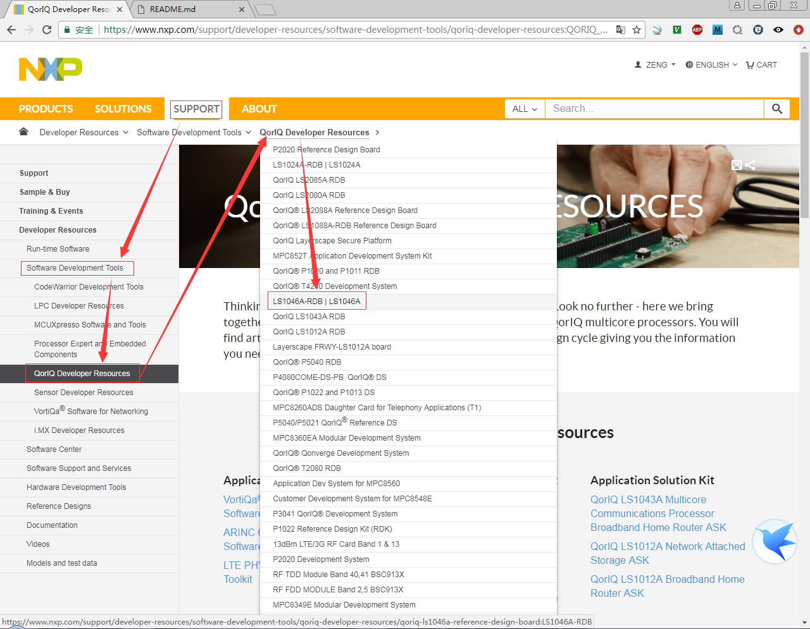

# LS1046ARDB Updating SDK Image

## Software Developer Resources Position




## Start Guide: 
* [QorIQ LS1046A Reference Design Board Getting Started Guide](https://www.nxp.com/webapp/Download?colCode=LS1046ARDBGSG)

## Support Ducuments

* [LS1046A-RDB: QorIQ LS1046A Reference Design Board](https://www.nxp.com/support/developer-resources/software-development-tools/qoriq-developer-resources/qoriq-ls1046a-reference-design-board:LS1046A-RDB?&fpsp=1&tab=Documentation_Tab)
* [Linux® SDK for QorIQ® Processors](https://www.nxp.com/support/developer-resources/software-development-tools/qoriq-developer-resources/qoriq-ls1046a-reference-design-board:LS1046A-RDB?tab=Design_Tools_Tab)

## Download

URL: [Linux® SDK for QorIQ® Processors](https://www.nxp.com/support/developer-resources/software-development-tools/qoriq-developer-resources/qoriq-ls1046a-reference-design-board:LS1046A-RDB?tab=Design_Tools_Tab)


目前下载使用：
* **QorIQ Linux SDK v2.0 SOURCE.iso**
* **QorIQ Linux SDK v2.0-1703.tar.bz2**

## 参考文档

[QorIQ LS1046A BSP v0.4](https://www.nxp.com/docs/en/supporting-information/QORIQ_LS1046A_BSP_V0-4_REV-A.pdf)

## 基本操作步骤

这里需要注意的就是先要安装基础SDK iso包，然后在安装不定包，基础包是没有LS1046支持的。

* `mkdir ls1046`
* `cp QorIQ\ Linux\ SDK\ v2.0\ SOURCE.iso ls1046`
* `cd ls1046`
* `sudo mount -o loop QorIQ\ Linux\ SDK\ v2.0\ SOURCE.iso /mnt/iso`
* `mkdir sdk`
* `cd sdk`
* `cp /mnt/iso/* . -r`
* `mkdir _install`
* `./install`
  ```
  zengjf@desk-ubuntu:~/ls1046$ ./install
  QorIQ-SDK-V2.0-20160527-yocto: Checking ISO integrity ...
  You are about to install the SDK built by Yocto
      QorIQ-SDK-V2.0-20160527-yocto
  
  Before installing , you must read and accept the EULA
  (End User License Agreement) which will be presented next.
  
  Do you want to continue ? Y|n
  Y
  IMPORTANT. Read the following NXP Semiconductors Software License Agreement
  ("Agreement") completely. By selecting the "I Accept" button at the end of
  this page, you indicate that you accept the terms of the Agreement and you
  acknowledge that you have the authority, for yourself or on behalf of your
  company, to bind your company to these terms. You may then download or install
  the file.
  
  NXP SEMICONDUCTORS SOFTWARE LICENSE AGREEMENT
  
  This is a legal agreement between you, as an authorized representative of your
  employer, or if you have no employer, as an individual (together "you"), and
  Freescale Semiconductor, Inc., a wholly-owned subsidiary of NXP Semiconductors
  N.V. ("NXP"). It concerns your rights to use the software identified in the
  Software Content Register and provided to you in binary or source code form and
  any accompanying written materials (the "Licensed Software"). The Licensed
  Software may include any updates or error corrections or documentation relating
  to the Licensed Software provided to you by NXP under this License. In
  consideration for NXP allowing you to access the Licensed Software, you are
  agreeing to be bound by the terms of this Agreement. If you do not agree to all
  of the terms of this Agreement, do not download or install the Licensed Software
  .
  If you change your mind later, stop using the Licensed Software and delete all
  copies of the Licensed Software in your possession or control. Any copies of the
  
  I have read and accept the EULA (yes|no):
  yes
  
  Where to install QorIQ-SDK-V2.0-20160527-yocto? (/home/zengjf)
  /home/zengjf/ls1046/sdk/_install/
  Making target directory /home/zengjf/ls1046/_install/QorIQ-SDK-V2.0-20160527-yocto
  Installing QorIQ-SDK-V2.0-20160527-yocto to /home/zengjf/ls1046/_install
  
  Installation complete.
  
  -e [Recommended]: to speed up the build, install cache ISO to /home/zengjf/ls1046/_install
  
  your SDK installation has been placed in
  /home/zengjf/ls1046/_install/QorIQ-SDK-V2.0-20160527-yocto, please execute following steps to continue:
  
      $ cd /home/zengjf/ls1046/_install/QorIQ-SDK-V2.0-20160527-yocto
      $ ./sources/meta-freescale/scripts/host-prepare.sh
        Install required host pkgs to run Yocto. Use option -f to run non-interactively.
      $ . ./fsl-setup-env -h
        Get help for creating build project
  
  zengjf@desk-ubuntu:~/ls1046$
  ```
* check pyton version: 
  ```
  zengjf@desk-ubuntu:~/ls1046$ python --version
  Python 2.7.6
  zengjf@desk-ubuntu:~/ls1046$
  ```
* `sudo apt-get install gawk wget git-core diffstat unzip texinfo gcc-multilib build-essential chrpath socat libsdl1.2-dev xterm`
* `sudo apt-get install lib32z1 lib32ncurses5 lib32bz2-1.0 lib32ncurses5-dev`
* `cd ~/ls1046`
* `tar xvf tar xvf QorIQ\ Linux\ SDK\ v2.0-1703.tar.bz2 # 假设该文件已经在这个目录了`
* `cd SDK-V2.0-1703`
* `./install`
  ```
  zengjf@desk-ubuntu:~/ls1046/SDK-V2.0-1703$ ./install
  Where is the installed QorIQ-SDK-V2.0-20160527-yocto? (/home/zengjf/QorIQ-SDK-V2.0-20160527-yocto)
  /home/zengjf/ls1046/sdk/_install/QorIQ-SDK-V2.0-20160527-yocto
  Installing...
  Configuring...
  
  Installation complete
  zengjf@desk-ubuntu:~/ls1046/SDK-V2.0-1703$
  ```
* `cd ~/ls1046/sdk/_install/QorIQ-SDK-V2.0-20160527-yocto/`
* `. ./fsl-setup-env -m ls1046ardb`
  ```
  zengjf@desk-ubuntu:~/ls1046/sdk/_install/QorIQ-SDK-V2.0-20160527-yocto/build_ls1046ardb$ pwd
  /home/zengjf/ls1046/sdk/_install/QorIQ-SDK-V2.0-20160527-yocto/build_ls1046ardb
  ```
* `bitbake fsl-image-minimal`
  * `fsl-image-minimal`: contains basic packages to boot up a board
  * `fsl-image-core`: contains common open source packages and NXP specific packages.
  * `fsl-image-full`: contains all packages in the full package list.
  * `fsl-image-kernelitb`: A FIT image comprising the Linux image, dtb and rootfs image.
  * `fsl-image-mfgtool`: contains all the user space apps needed to deploy the fsl-image-mfgtool image to a USB stick, hard drive, or other large physical media.
  * `fsl-image-virt`: contains toolkit to interact with the virtualization capabilities of Linux
  * `core-image-x11`: NXP image with a very basic X11 image with a terminal
  * `fsl-toolchain`: the cross compiler binary package
  * `package-name(usdpaa)`: build a specific package
* `ls tmp/deploy/images/ls1046ardb/`
  * `fsl-image-<machine>.ext2.gz.u-boot` - ramdisk image that can be loaded with U-Boot
  * `fsl-image-<machine>.ext2.gz` - gzipped ramdisk image
  * `fsl-image-<machine>.tar.gz` - gzipped tar archive of the image
  * `uImage-<machine>.bin` - kernel binary of the image
  * `u-boot-<machine>.bin` - U-Boot binary image that can be programmed into board Flash
  * `uImage-<machine>.dtb` - device tree binary (dtb).
  * `fsl_fman_ucode_<machine>_<version>.bin` - fman ucode for <machine> board
  * `hv/hv.uImage` - uImage for hypervisor
  * `hv-cfg/*/*/hv.dtb` - dtb for hypervisor
  * `rcw/*/rcw_*.bin` - rcw
  ```
  zengjf@desk-ubuntu:~/ls1046/sdk/_install/QorIQ-SDK-V2.0-20160527-yocto/build_ls1046ardb$ ls tmp/deploy/images/ls1046ardb/
  aq_programming.bin
  AQR-G2_v3.1.5-AQR_RevB_AQR107_ID16068_VER385.cld
  byte_swap.tcl
  fsl_fman_ucode_ls1046_r1.0_106_4_18.bin
  fsl_fman_ucode_ls1046_r1.0_108_4_9.bin
  fsl-image-core-ls1046ardb-20180317075105.rootfs.ext2.gz
  fsl-image-core-ls1046ardb-20180317075105.rootfs.ext2.gz.u-boot
  fsl-image-core-ls1046ardb-20180317075105.rootfs.jffs2
  fsl-image-core-ls1046ardb-20180317075105.rootfs.manifest
  fsl-image-core-ls1046ardb-20180317075105.rootfs.tar.gz
  fsl-image-core-ls1046ardb-20180317075105.rootfs.ubi
  fsl-image-core-ls1046ardb-20180317075105.rootfs.ubifs
  fsl-image-core-ls1046ardb.ext2.gz
  fsl-image-core-ls1046ardb.ext2.gz.u-boot
  fsl-image-core-ls1046ardb.jffs2
  fsl-image-core-ls1046ardb.manifest
  fsl-image-core-ls1046ardb.tar.gz
  fsl-image-core-ls1046ardb.ubi
  Image
  Image--4.1-r0-fsl-ls1046a-rdb-20180317075105.dtb
  Image--4.1-r0-fsl-ls1046a-rdb-usdpaa-20180317075105.dtb
  Image--4.1-r0-ls1046ardb-20180317075105.bin
  Image-fsl-ls1046a-rdb.dtb
  Image-fsl-ls1046a-rdb-usdpaa.dtb
  Image-ls1046ardb.bin
  modules--4.1-r0-ls1046ardb-20180317075105.tgz
  modules-ls1046ardb.tgz
  ppa.itb
  ppa-ls1046ardb-20180317075105.itb
  rcw
  README_-_DO_NOT_DELETE_FILES_IN_THIS_DIRECTORY.txt
  ubinize.cfg
  u-boot.bin
  u-boot-emmc-2016.09+fslgit-r0.bin
  u-boot-emmc.bin
  u-boot-ls1046ardb.bin
  u-boot-qspi-2016.09+fslgit-r0.bin
  u-boot-qspi.bin
  u-boot-qspi-secure-boot-2016.09+fslgit-r0.bin
  u-boot-qspi-secure-boot.bin
  u-boot-sdcard-2016.09+fslgit-r0.bin
  u-boot-sdcard.bin
  zengjf@desk-ubuntu:~/ls1046/sdk/_install/QorIQ-SDK-V2.0-20160527-yocto/build_ls1046ardb$
  ```
